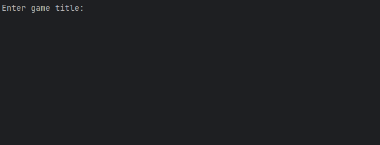

# Game Price Comparer

A Python project that compares game prices between Steam (scraping) and IsThereAnyDeal (ITAD) API, while also fetching Metacritic ratings from RAWG. This project demonstrates working with APIs, web scraping, and OOP in Python.

## Features

- Scrapes Steam for current game prices
- Fetches price data from ITAD API
- Gets Metacritic ratings from RAWG API
- Compares prices and outputs which store is cheaper

## Demo



## Technologies Used

- Python 3.x
- Requests
- BeautifulSoup4
- python-dotenv
- OOP structure

## Installation

1. Clone the repository:


2. Create a `.env` file in the project root with your API keys:
```
RAWG_API_KEY=your_rawg_key
ITAD_API_KEY=your_itad_key
```

3. Install required packages:
```bash
pip install -r requirements.txt
```

## Usage

Run the main script and follow the prompt to enter a game title:

```bash
python main.py
```

Example output:
```
Enter game title: Cyberpunk 2077
Steam's price: $29.99
ITAD's price: $24.99
ITAD (API) is cheaper by 5.00
```

## Notes / Future Improvements

- Some error handling and API parsing could be improved.  
- Price parsing may be refined to handle free games, regional formats, and edge cases.  
- Optional GUI version could be added.

## License

This project is open-source and free to use.
